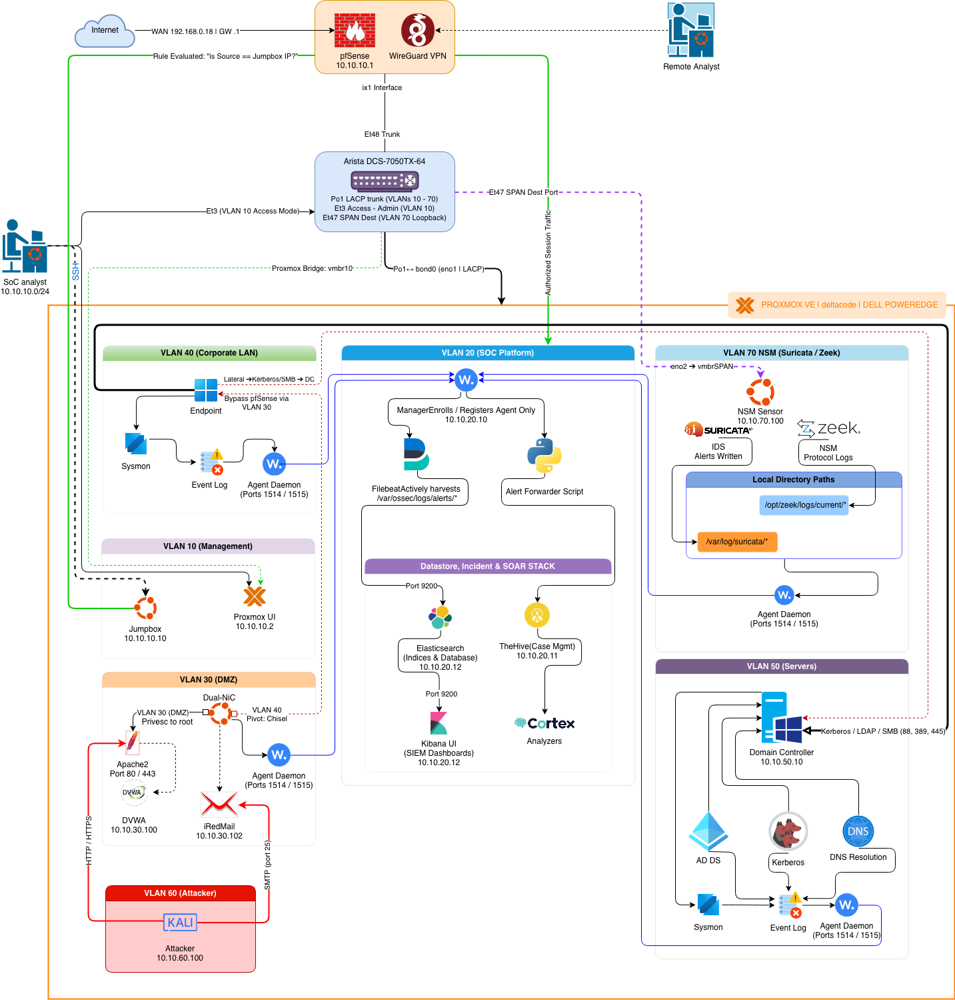

# DeltaCode Network Architecture

<<<<<<< HEAD

=======
> 🔧 **TODO (Sam):** Drop your color SVG network diagram in this folder as `deltacode-architecture.svg` and it will render below.


## VLAN Segmentation

| VLAN | Purpose | Key Hosts |
|---|---|---|
| MGMT | Infrastructure management | Proxmox, Arista mgmt, pfSense |
| SOC | Security tooling | Wazuh manager, Elastic Stack, TheHive/Cortex |
| NSM | Network monitoring | `nsm-sensor` (Suricata + Zeek + Filebeat) |
| CORP | Simulated corporate network | Windows endpoints (Sysmon), iRedMail |
| SRV | Server segment | Domain controller, file/app servers |
| ATTACK | Adversary emulation | Kali Linux, Atomic Red Team runner |
| DMZ | External-facing services | Reverse proxy / exposed test services |

> 🔧 **TODO (Sam):** Correct this table to match your actual 7 VLANs — names, purposes, hosts.

## Traffic Visibility

- SPAN/mirror from the Arista 7150 feeds the NSM sensor
- Suricata provides signature-based IDS alerting
- Zeek provides protocol metadata (conn, dns, http, ssl, files logs)
- Filebeat 8.x ships Zeek logs → Elasticsearch (dedicated pipeline)
- Wazuh agents on all endpoints provide host telemetry (FIM, Sysmon, auth logs)

## Data Flow Summary

```
Endpoints (Sysmon/auditd) ──► Wazuh Manager ──► Wazuh Indexer
                                   │
                                   └──► TheHive (Python integration, MITRE-tagged)
                                              │
                                              └──► Cortex (VT, AbuseIPDB, MaxMind, URLScan, Shodan)

Network (SPAN) ──► Suricata ─┐
                             ├──► Filebeat ──► Elasticsearch ──► Kibana
                 Zeek ───────┘

Mail flow ──► iRedMail (Amavis/SpamAssassin/ClamAV) ──► Wazuh custom rules 100300–100306
```

## Remote Access

WireGuard tunnel terminating on pfSense for secure remote lab access.
